Angular入门学习笔记

<!-- more -->

# 目录
[前述](#前述)
[核心](#核心)
- [路由](#路由)
-  [组件通信](#组件通信)
- [管道](#管道)
- [生命周期](#生命周期)
- [其他](#其他)

# 前述
1、1.X 是 AngularJS。AngularJS 表明，它是用 JavaScript 编写的；而 2 是 Angular， 是用 TypeScript 语言编写的。
2、AngularJS 采用 MVC，而 Angular 采用 MVVM ，采用面向组件的开发模式
3、「Angular ≈ Vue + vue-router + axios + karma + 表单验证插件 + i18n ……」so， angular是一个完整的框架，完整的解决方案
- 优势：
1. Angular 的工程师将我们需要的所有功能做了不错的整合。（如果使用 Vue，我可能还要面临更多选择。）
2. Angular 的一份文档涵盖了开发中的方方面面。（如果使用 Vue，可能每个功能要去看不同的文档。）
3. Angular 更强势更主观，它的文档对于如何完成某个功能给出了明确的建议。

# 核心
## 路由
### 根模块路由
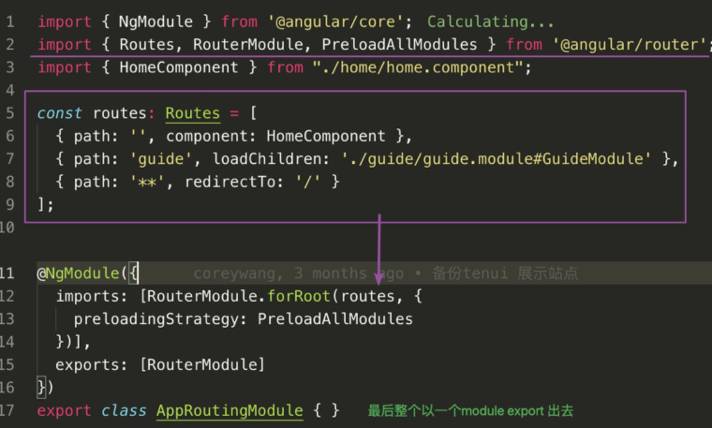

> 1、第7行 ，实现模块的懒加载（实际也是加载模块里的组件）
2、第8行，任意路由，匹配不到路由的时候就强制路由到这里
3、第12行，forRoot 是用在根模块加载路由配置
4、第13行，提供预加载策略，尽可能快地预加载所有模块。

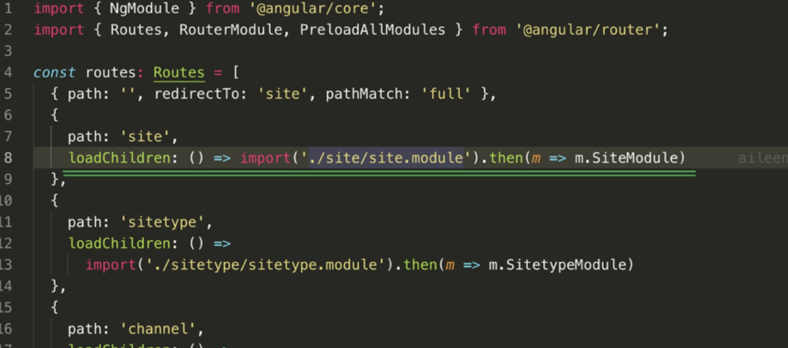
> 第8行，同样是模块懒加载（实际也是加载模块里的组件）

模板处用`router-outlet`占位
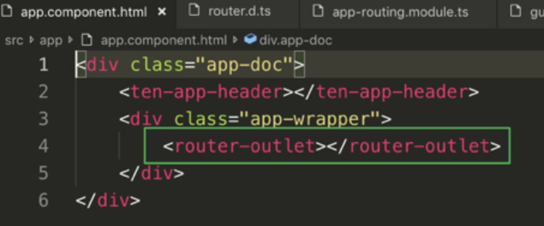

另外，需要在app module的imports添上这个路由模块
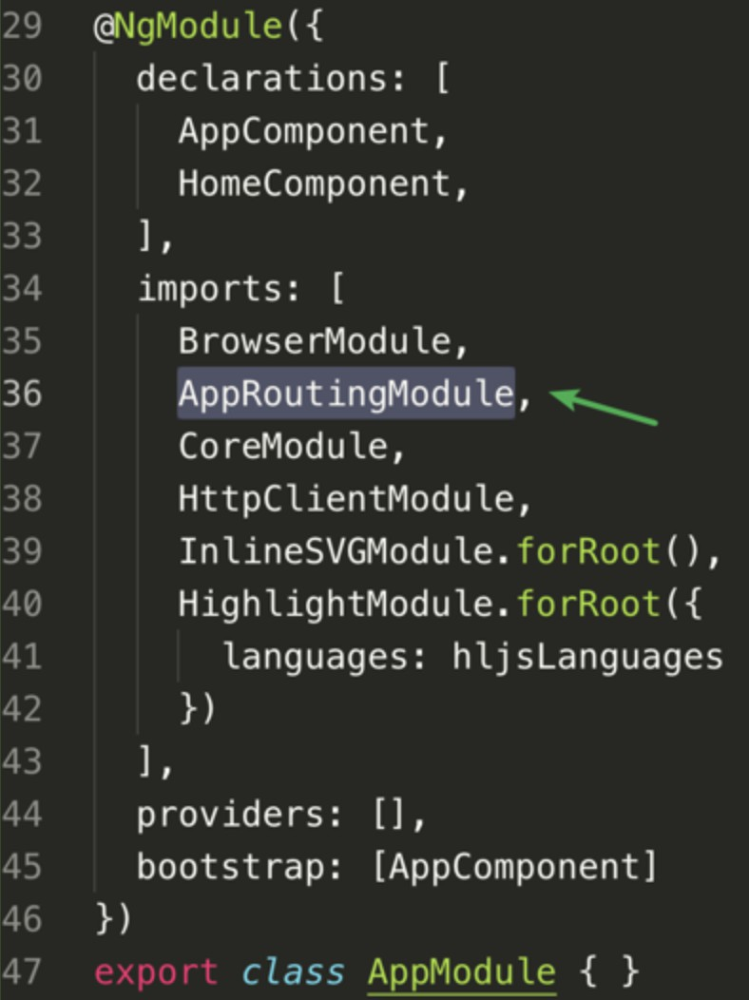

### 子模块路由

> 1、第10行，对比前面的加载模块（loadChildren），这里是加载组件（component）
2、第19行，forChild是用在子模块加载路由配置

### 嵌套路由

### 动态路由

`http://域名/site/app` :  这里的 `app` 就是 `:sitetypeId` 占位的值

- 此处有一个坑：

> 路由是有顺序的！
看上面代码：
之前一直匹配不上当路由到record的时候，因为把record写在了后面，然后就被匹配成了:sitetypeId的路由，就一次跳去编辑页了！！

- 路由url中参数传值
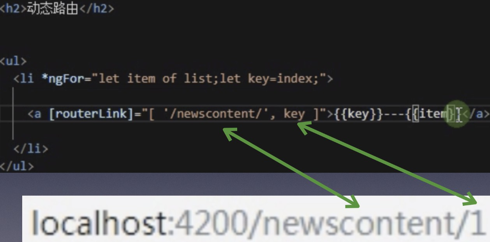
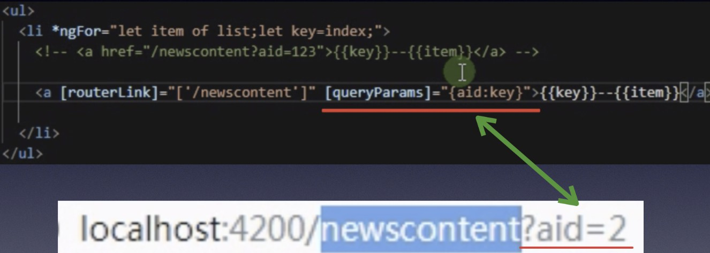

- 路由url参数取值
eg: `http://域名/app/edit/multi/create?atype=type_12&column=live`

看上面的路由，要获取相应的参数：
> 上面的  multi 对应 :type ;  create对应 :id
获取相应参数要用 this.route.paramMap

> 要获取上面的atype和column的值要用 this.route.queryParamMap

- 补充
自动化命令：生成模块的时候加上` --routing` ，那么就会在生成的这个模块里加上相应的路由
`ng g module module/user --routing`
总结：
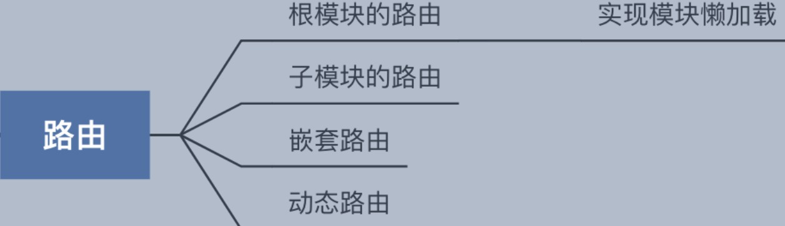

## 组件通信
### 父组件给子组件传值 - 利用 输入属性@Input()

### 子组件给父组件传值 - 利用 输出属性@Output()

### 父组件与子组件通过本地变量互动

> 父组件调用子组件的时候 把本地变量(#timer)放到(<countdown-timer>)标签中，用来代表子组件
即 在子组件上 用  #xxx  做标记，
这样 父组件的模板 就得到了 子组件的引用 ， 于是 可以在父组件的模板中 访问子组件的 所有属性和方法

- 本地变量方法的局限
父组件-子组件的连接 必须全部在父组件的模板中进行。
父组件本身的代码对子组件没有访问权。
如果父组件的类需要读取子组件的属性值或调用子组件的方法，就不能使用本地变量方法。

- 父组件利用@ViewChild() 来和子组件互动
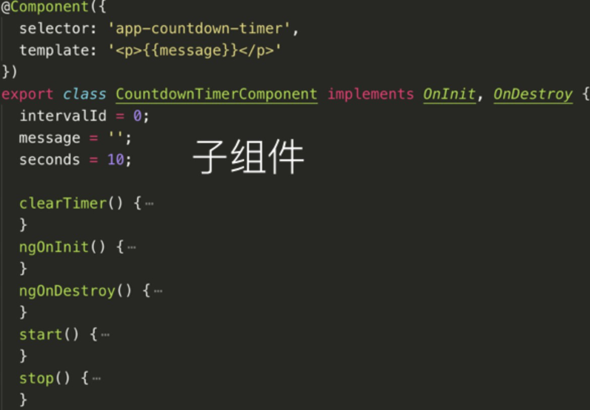
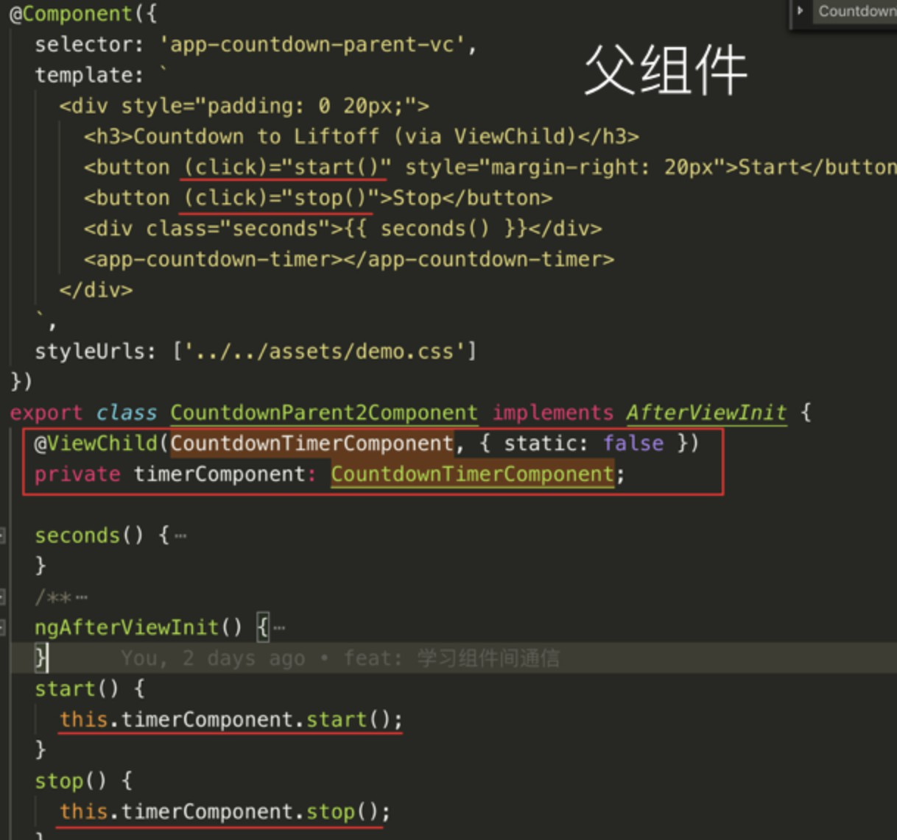
> 当 父组件 的 类 需要 读取子组件的属性 或 调用子组件的方法时， 可以 把 子组件 作为 ViewChild 注入到父组件里
用@ViewChild装饰器，把 子组件 注入 到父组件的属性（timerComponent）上，父组件的类中 就可以利用 timerComponent 属性 调用 子组件中的所有属性和方法 了

### 父组件 和 子组件 通过服务来通讯
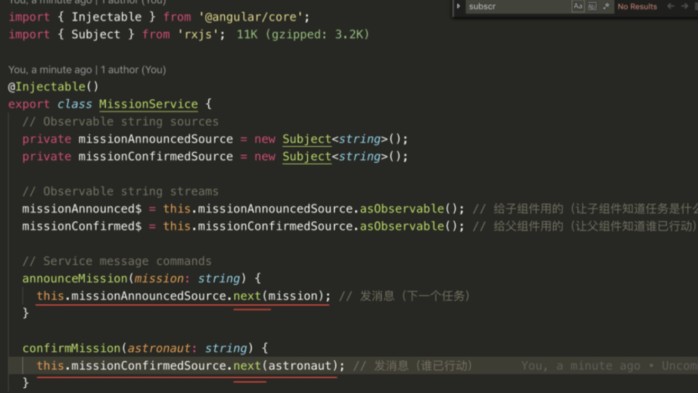
> 这是一个服务，服务要使用@Injectable() 装饰器
利用Subject 可以进行发布订阅， Subject的实例 可以 用next来发布消息

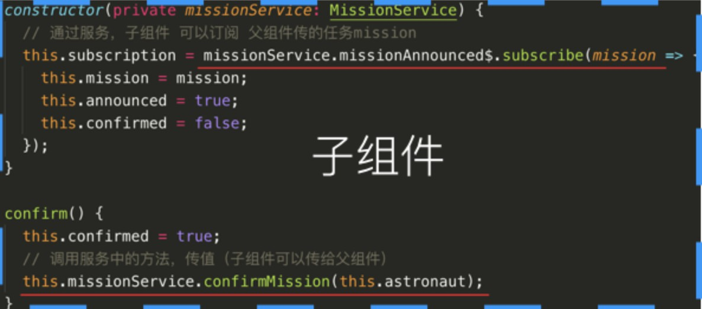
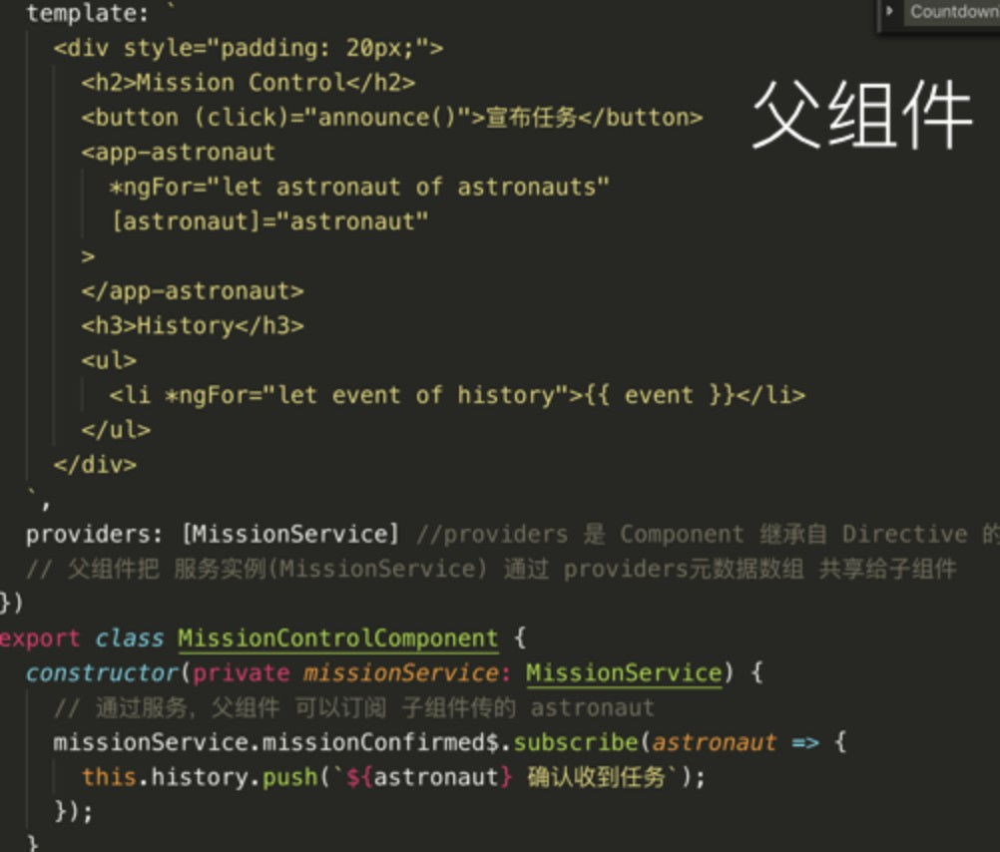
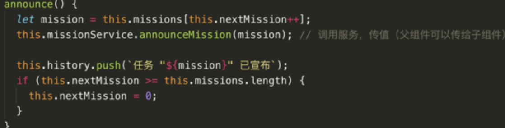

总结：
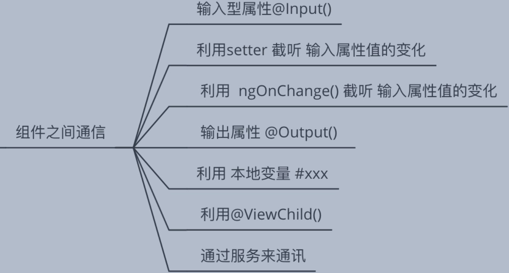

## 管道
&nbsp;一种 可以转换 模板中数据展现情况的 途径
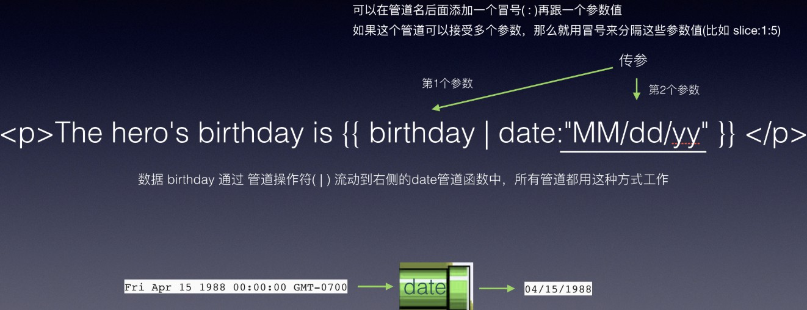
### 内置管道
Angular 内置了一些管道，比如 DatePipe、UpperCasePipe、LowerCasePipe、CurrencyPipe 和 PercentPipe。 它们全都可以直接用在任何模板中。
api: https://www.angular.cn/api?type=pipe
> async： 从一个异步回执中解出一个值
currency： 把数字转换成金额字符串
percent：把数字转换成百分比字符串
…

### 链式管道
可以把管道串联在一起，以组合出一些潜在的有用功能
`The chained hero's birthday is
{{  birthday | date:'fullDate' | uppercase}} `

### 自定义管道
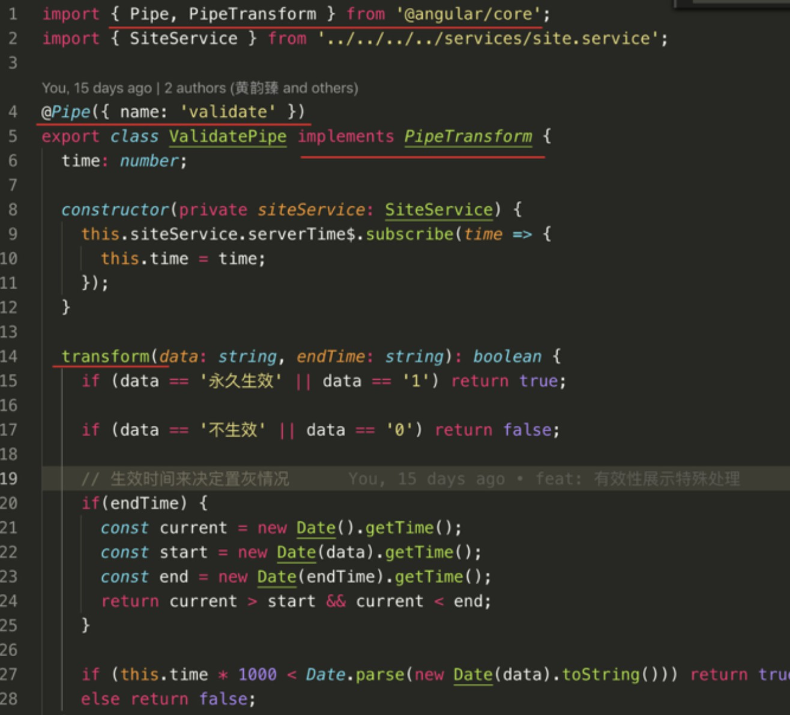
> 1、第4行，@Pipe&nbsp;装饰器告诉angular这是一个管道，name定义管道的名字
2、第5、14行，管道要实现(implements)PipeTransform的transform&nbsp;方法，该方法接受一个输入值和一些可选参数，并返回转换后的值
管道是一个带有“管道元数据(pipe metadata)”装饰器的类

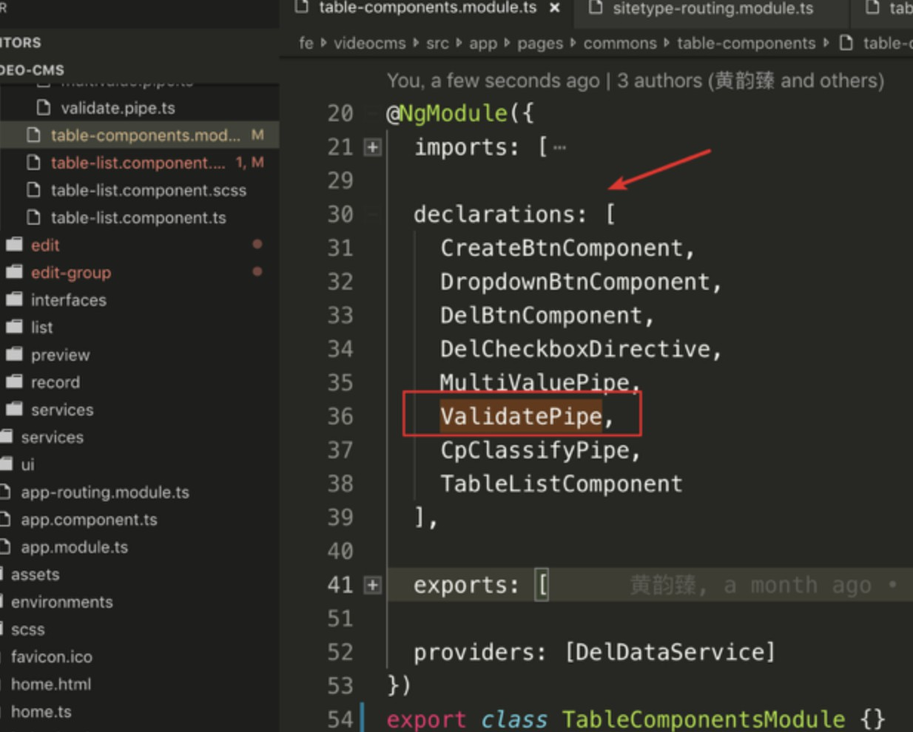
注意： 必须把这个管道添加到&nbsp;这个组件的根模块&nbsp;的&nbsp;declarations&nbsp;数组中，否则会报错！

总结：
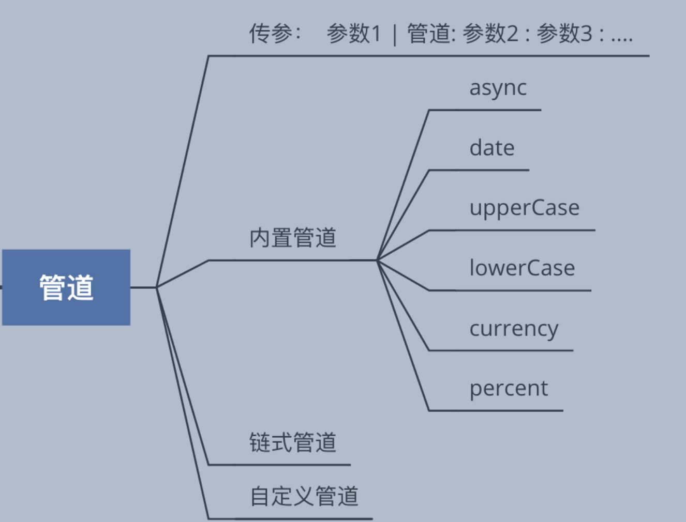

## 生命周期
| 生命周期钩子 | 用途&时机|--|
|--|--|--|
| `ngOnChanges()` |当数据绑定输入属性的值发生变化时调用。|用在父子组件传值之中 父组件给子组件传值的时候； 父组件改变传值的数据的时候会触发
| `ngOnInit()` |在第一次 ngOnChanges 后调用 **只调用一次**|
| `ngDoCheck()` |自定义的方法，用于检测和处理值的改变|
|`ngAfterContentInit()`|在组件内容初始化之后调用 **只调用一次**|
|`ngAfterContentChecked()`|组件每次检查内容时调用|
|`ngAfterViewInit()`|初始化完 组件视图 及其 子视图 之后 调用；  第一次 ngDoCheck()之后调用 **只调用一次**|视图加载完成的时候触发 一般可以进行dom操作
|`ngAfterViewChecked()`|组件每次检查视图时调用|
|`ngOnDestroy()`|指令销毁前调用|

## 其他
### vscode 插件
- Angular 8 Snippets：增加了AngularJs 1在.html和.js中的代码补全，安装后每次打开自动启用。
- Angular Files：生成Angular的文件模板（Component、Module、Pipe等等）
- Angular Follow Selector：文件跳转（Component跳转到html、scss文件）
- Angular Language Service：引用填充和跳转到定义（html中进行引用补全）

### angular 8
在新的知识点方面，主要新增的内容有：
1. Schematics&nbsp;- 原理图：这是一个通用的生成器，Angular CLI 大量依赖它，并且你也可以自定义 Schematics 来提升团队开发效率并保持一致性。这已经是一个事实上的最佳实践了，引入它绝对物超所值。
2. Ivy：这是 Angular 的下一代渲染引擎，在 v8 已经可以尝试了，只是还没有作为默认选项，这里的文档会指引你体验它。
3. Web Worker：对于计算密集型的应用，Web Worker 可以显著提升界面性能，而 Angular CLI 可以用一条命令创建调用 Web Worker 的骨架代码。
4. Bazel：Google 内部已经使用了很长时间的构建系统，有很多优点，特别是在大规模项目下所向披靡。Angular CLI 曾经是基于 Webpack 的，但是现在你可以切换成使用 Bazel。如果你现在的基于 Webpack 的构建过程遇到了难以克服的困难，可以试试看用 Bazel 能否解决它。
除此之外，Angular 文档中还专门增加了一章，用于汇总所有已废弃的 API 和功能，当你升级应用的时候可能会用到它。