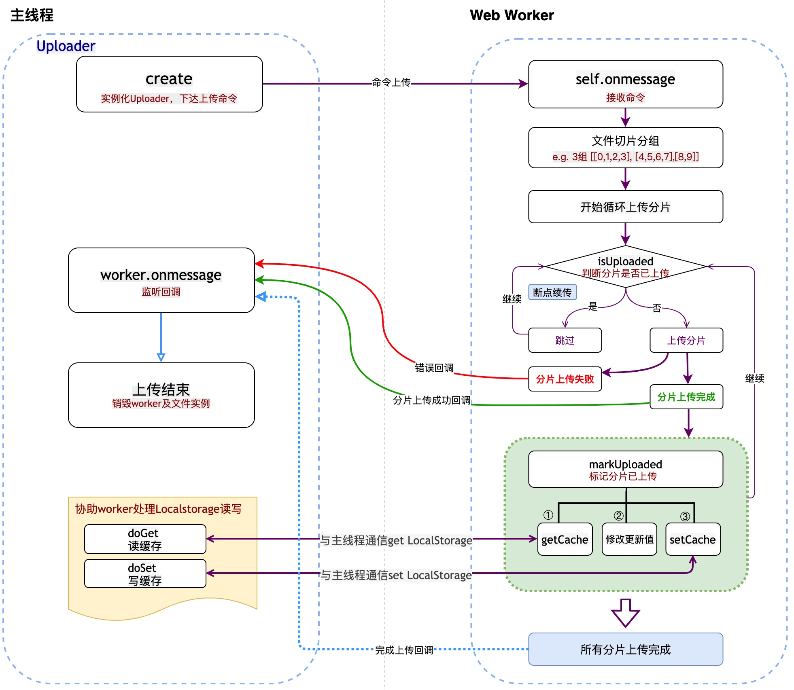
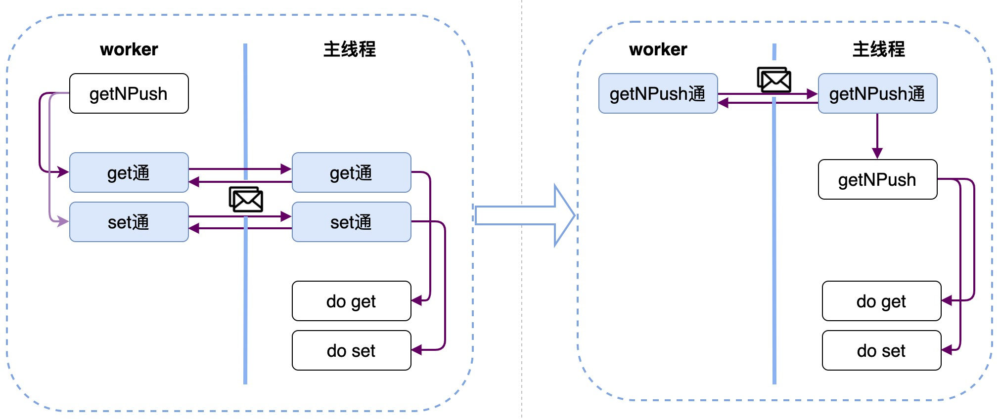
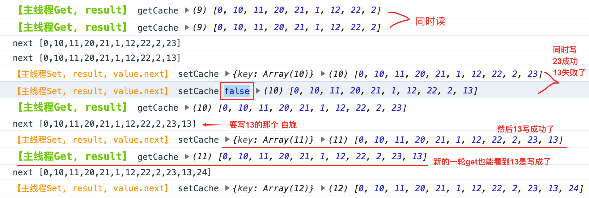

业务里的有大文件上传场景，所以单独封装出分片上传前端库以便各业务复用。
在开发分片上传库的过程中，遇到了并发问题。下面分析下怎么遇到的问题，以及怎么解决的。

<!-- more -->


**目录**

[TOC]


## topic涉及的内容
- 事件循环：Promise、async await、setTimout执行顺序
- 并发问题：竞态条件、原子性
- 解决并发：在临界区使用同步、乐观锁、悲观锁、消除共享资源

## 大文件分片上传
### 功能点
- 分片上传
- 并行上传
- 断点续传
- 引入Web Worker提高性能

### 整体方案
- 指定每片大小：sizePerChunk，指定并行数量：parallelNumber
- 将大文件按指定分片大小、并行数量进行切割分组
- 每组间并行上传，同组内串行
- 上传完的存Localstorage记录，上传前判断已经存了就跳过上传
- Web Worker不支持读写Localstorage，需借助主线程读写
- 因太多异步方法，充分利用async await 来保证代码逻辑清晰


### 分片上传库的伪代码
> 为了简化问题便于大家理解，此处代码把与问题不相干的逻辑省略。

```
// Web Worker
function UploadWorker() {
    self.onmessage= e => {
        // 省略：
        // 接受上传文件的命令
        // 计算文件属性：fileUid、处理分片等
        // 调用uploadParallelly并行上传
    }
    // 并行上传
    uploadParallelly = async parallelNumber => {
        // 根据分片大小 计算总分片数
        const chuckCount = Math.ceil((fileSize / sizePerChunk));
        const loopLen = Math.ceil(chunkCount/parallelNumber);
        const loopTaskList = []; // e.g. [[0,1,2,3], [4,5,6,7],[8,9]]
        // 允许多少parallelNumber，就有多少个uplodLoop
        for(let i = 0; i < chunkCount; i+=loopLen) {
            loolTaskList.push(uploadLoop(i, Math.min(i+loopLen, chuckCount)));
        }
        await Promise.all(loopTaskList);
    }

    // 循环分片上传
    uploadLoop = (start, end) => {
        for(let i = 0; i < end; i++) {  // [start, end)
            // 省略 文件切割逻辑
            await doUploadChunk(i);
        }
    }

    // 上传某一片
    doUploadChunk = async chunkIndex => {
        // 已上传的就跳过，实现断点续传
        if(await isUploaded(chunkIndex)) return;
        // 省略 await上传chunkContent
        await markUploaded(chunkIndex);
    }
    // 标记分片已上传
    markUploaded = async chunkIndex => {
        const chunkList = await getCache(fileUid);
        const nextList = [...chunkList, chunkIndex];
        await setCache(fileUid, nextList);
    }

    // 判断分片是否已上传
    isUploaded = chunkIndex => {
        const chunkList = await getCache(fileUid);
        return chunkList.includes(chunkIndex);
    }

    getCache = async key {
        // 省略 与主线程通信get LocalStorage
    }

    setCache = () => {
        // 省略 与主线程通信set LocalStorage
    }
}

// 主进程
class Uploader {
    create() {
        // 实例化Uploader，下达上传命令
        // 协助worker处理Localstorage读写
    }
}
```
- 流程图


### 问题
Localstorage记录的某一个fileUid 已上传分片数组，偶尔会少几片，例如：

|  key |  value  |  现象  |
| ------------ | ------------ | ------------ |
| upload_task_xxxx  | [0, 1, 2, 3, 6, 7, 8, 9]  | 发现4，5两片不见了(并发数为3) |

### 原因分析
我们看下markUploaded方法的实现，异步先读 - 再改 - 异步再写，加上并发调用，典型地容易触发竞态条件。

> 竞态条件：当多个线程竞争同一资源时，如果对资源的访问顺序敏感，就称 存在竞态条件。
导致竞态条件发生的代码区称作临界区。


接下来详细分析这个问题，看下markUploaded方法干了件什么事情。

```
// 标记已上传（临界区）
markUploaded = async chunkIndex => {
	const chunkList = await getCache(fileUid);    // 先读
	const nextList = [...chunkList, chunkIndex];  // 再改
	await setCache(fileUid, nextList);            // 再写
}
```

因为此处的markUploaded方法不是原子性的，所以产出了并发问题。

> 原子性： 一个程序执行时不可被中断的,它要么完整的被成功执行,要么完全不执行，即“同生共死”的感觉。这种特性就叫原子性。

###### 举个栗子：
A要从自己的帐户中转1000元到B的帐户里。
从A开始转帐，到转帐结束的这一个过程，称之为一个事务。在这个事务里，要做如下操作：

1. 从A的帐户中减去1000元(A的帐户原有3000元，现在就变成2000元了)。
2. 在B的帐户里加1000元(B的帐户原有2000元，现在变成3000元了)。

如果在A的帐户已经减去了1000元的时候，忽然发生了意外，比如停电什么的，导致转帐事务意外终止了，而此时B的帐户里还没有增加1000元。那么，我们称这个操作失败了，要进行回滚。
回滚就是回到事务开始之前的状态，也就是回到A的帐户还没减1000元的状态，B的帐户的原来的状态。此时A的帐户仍然有3000块，B的帐户仍然有2000块。

把这种要么一起成功（A帐户成功减少1000，同时B帐户成功增加1000），要么一起失败（A帐户回到原来状态，B帐户也回到原来状态）的操作叫原子性操作。


###### 事件循环
事件循环决定了JS引擎什么时候执行什么代码；

此处对事件循环就不过多展开了，篇尾有相关文档可了解。

这里简单讲下await的等待机制：

如果 await 后面跟的不是一个 Promise，那 await 后面表达式的运算结果就是它等到的东西；
如果 await 后面跟的是一个 Promise 对象，await 它会“阻塞”后面的代码，等着 Promise 对象 resolve，然后得到 resolve 的值作为 await 表达式的运算结果。
await 必须用在 async 函数中。async 函数调用不会造成“阻塞”，它内部所有的“阻塞”都被封装在一个 Promise 对象中异步执行。（这里的阻塞理解成异步等待更合理）


看markUploaded方法中第一行代码，await 后面紧跟着的getCache是立刻执行的，接下来后面的代码就会被“阻塞”，所以markUploaded这个方法就不具备原子性，才会导致并发问题的产生
```
// 标记已上传（临界区）
markUploaded = async chunkIndex => {
	const chunkList = await getCache(fileUid);    // 先读
	const nextList = [...chunkList, chunkIndex];  // 再改
	await setCache(fileUid, nextList);            // 再写
}
```

##### 抽离出问题原型
- worker的逻辑：异步的getCache、异步的setCache和异步的getNPush 用来对一个 数组 进行读、改、写。分析在并发场景下，getNPush的稳定性。
- 主线程的逻辑：配合web worker提供cache data的逻辑

ps：以下模拟问题的代码可直接在控制台执行

```
// Web Worker
function UploadWorker() {
    self.onmessage = e => {
        const {type, data, uid} = e.data;
        if(type === 'run') run(data);
        // 监听主线程的cache读写结果
        trigger(type, data, uid);
    }
    getCache = async key => {
        const uid = Math.random();
        return new Promise(resolve => {
            let cb = (result, retUid) => {
                if(retUid !== uid) return;
                resolve(result);
                off('getCache', cb);
            };
            on('getCache', cb);
            self.postMessage({type: 'getCache', data: {key, uid}})
        });
    }
    setCache = async (key, value) => {
        const uid = Math.random();
        return new Promise(resolve => {
            let cb = (result, retUid) => {
                if(retUid !== uid) return;
                resolve(result);
                off('setCache', cb);
            };
            on('setCache', cb);
            self.postMessage({type: 'setCache', data: {key, value, uid}})
        });
    }
    getNPush = async (key, value) => {
        const src=  await getCache(key) || [];
        const next = [...src, value];
        console.log('next', JSON.stringify(next))
        await setCache(key, next);
    }
    // 搞个简单的自定义事件
    pool = {};
    on = (type, cb) => {
        pool[type] = pool.hasOwnProperty(type) ? [...pool[type], cb]: [cb];
    }
    off = (type, cb) => {
        if(!pool[type]) return;
        pool[type].splice(pool[type].indexOf(cb), 1);
    }
    trigger = (type, ...args) => {
        if(!pool[type]) return;
        pool[type].forEach(fn => fn.apply(null, args))
    }
    // 模拟并发调用
    run = async type => {
        KEY = 'key';
        delay = (sec, fn, ...args) => new Promise(resolve => {
            setTimeout(() => resolve(fn(...args)), sec)
        });
        loop1 = async (start, end) => {
            for(let i = start; i < end; i++) {
                await delay(Math.random()*100, getNPush, KEY, i);  // 随机[0,100)ms触发getNPush
            }
        }
        switch(type) {
            case 'loop1':
                await setCache(KEY, []);  // 先清空一下缓存数据
                await Promise.all([loop1(0,10), loop1(10,20), loop1(20,30)]);
                console.log('===loop1===', await getCache(KEY));
                break;
        }
    }
}
// 主线程
w = new Worker(URL.createObjectURL(new Blob([`(${UploadWorker.toString()})()`])));
w.onmessage = e => {
    const {type, data: {key, value, ...extra}} = e.data;
    let result;
    switch(type) {
        case 'setCache':
            result = doSet(key, value);
            console.log('%c【主线程Set: result,value】','color:#fe950e;',type, result, value)
            break;
        case 'getCache':
            result = doGet(key);
            console.log('%c【主线程Get: result】','color:#72c911;font-weight:bold;font-size:10pt',type, result)
            break;
    }
    w.postMessage({type, data: result, ...extra})
}
// 用内存变量代替Localstorage方便观察分析
data = {};
doSet = (key, value) => {
    data[key] = value;
    return data;
}
doGet = key => {
  return key ? data[key] : data;
}
w.postMessage({type: 'run', data: 'loop1'});


// 以上 并不是每次执行完 数组长度都是30.
```


### 解决方案
#### 方案1

getNPush不是原子的。因为getCache是异步的，会发生上下文切换。

```
	getNPush = async (key, value) => {
		const src=  await getCache(key) || [];  // 先读
		const next = [...src, value]; 			// 再改
		await setCache(key, next); 				// 再写
	}
```

思路：
把getNPush改为原子的。

怎么改？
去掉await get 和await set，那么getNPush就是纯同步的代码，对于单线程的JS执行，一定是原子的。所以就可以把getNPush放到主线程实现来达到目的。



```
// Web Worker
function UploadWorker() {
    self.onmessage = e => {
      const {type, data, uid} = e.data;
      if (type === 'run') run(data);
      // 监听主线程的cache读写结果
      trigger(type, data, uid);
    }
    getCache = async key => {
      const uid = Math.random();
      return new Promise(resolve => {
        let cb = (result, retUid) => {
          if (retUid !== uid) return;
          resolve(result);
          off('getCache', cb);
        }
        on('getCache', cb);
        self.postMessage({type: 'getCache', data: {key, uid}})
      });
    }
    setCache = async (key, value) => {
      const uid = Math.random();
      return new Promise(resolve => {
        let cb = (result, retUid) => {
          if (retUid !== uid) return;
          resolve(result);
          off('setCache', cb);
        }
        on('setCache', cb);
        self.postMessage({type: 'setCache', data: {key, value, uid}})
      });
    }
    // >>>>>>>> 修改
    getNPush = async(key, value) => {
      const uid = Math.random();
      return new Promise(resolve => {
        let cb = (result, retUid) => {
          if (retUid !== uid) return;
          resolve(result);
          off('getNPush', cb);
        }
        on('getNPush', cb);
        self.postMessage({type: 'getNPush', data: {key, value, uid}})
      });
    }
    // <<<<<<<<< 修改
    // 搞个简单的自定义事件
    pool = {};
    on = (type, cb) => {
      pool[type] = pool.hasOwnProperty(type) ? [...pool[type], cb] : [cb]
    }
    off = (type, cb) => {
      if (!pool[type]) return
      pool[type].splice(pool[type].indexOf(cb), 1)
    }
    trigger = (type, ...args) => {
      if (!pool[type]) return
      pool[type].forEach(fn => fn.apply(null, args))
    }
    // 模拟并发调用
    run = async type => {
        KEY = 'key'
        delay = (sec, fn, ...args) => new Promise(resolve => setTimeout(() => resolve(fn(...args)), sec))
        loop1 = async (start, end) => {
          for (let i=start; i<end; i++) {
            await delay(Math.random()*100, getNPush, KEY, i)
          }
        }
        switch(type) {
            case 'loop1':
                await setCache(KEY, []);
                await Promise.all([loop1(0, 10), loop1(10, 20), loop1(20, 30)]);
                console.log('======loop1', await getCache(KEY));
                break;
        }
    }
}
// 主线程
w = new Worker(URL.createObjectURL(new Blob([`(${UploadWorker.toString()})()`])))
w.onmessage = (e) => {
    const {type, data: {key, value, ...extra}} = e.data;
    let result;
    switch (type) {
        case 'setCache':
          result = doSet(key, value);
          break
        case 'getCache':
          result = doGet(key);
          break;
        // >>>>>>>> 增加
        case 'getNPush':
          result = getNPush({key, value});
          break;
        // <<<<<<<<< 增加
    }
    console.log('%c【主线程 type,result,value】','color:#fe950e;',type, result, value)
    w.postMessage({type, data: result, ...extra})
}
// >>>>>>>> 增加
getNPush = data => {
    const { key, value } = data;
    const src = doGet(key);
    const next = [...src, value];
    return doSet(key, next);
}
// <<<<<<<<< 增加
// 用内存变量代替LocalStorage方便分析
data = {}
doSet = (key, value) => {
  data[key] = value;
  return data;
}
doGet = key => {
  return key ? data[key] : data;
}
// 触发worker测试并发执行
w.postMessage({type: 'run', data: 'loop1'})


// 每次执行都是稳定的30个了
```


#### 方案2
乐观锁的思路：写入时CAS+自旋

说明：
> 乐观锁：本质上是乐观的，认为别的线程不会去修改值。如果发现值被修改了，可以再次重试(自旋)。`CAS机制`就是一种乐观锁。

> CAS(Compare And Swap):比较并交换，该操作通过将内存中的值与指定数据进行比较，当数值一样时将内存中的数据替换为新的值。

补充：ABA问题
> 因为CAS需要在操作值的时候检查下值有没有发生变化，如果没有发生变化则更新，但是如果一个值原来是A，变成了B，又变成了A，那么使用CAS进行检查时会发现它的值没有发生变化，但是实际上却变化了。ABA问题的解决思路就是使用版本号（`版本号机制`）。在变量前面追加上版本号，每次变量更新的时候把版本号加一，那么A－B－A 就会变成1A-2B－3A。
因为在我这个文件上传更新缓存这个场景是不会遇到ABA问题的，所以是可以直接比对的。

```
// Web Worker
function UploadWorker() {
    self.onmessage = e => {
      const {type, data, uid} = e.data;
      if (type === 'run') run(data);
      // 监听主线程的cache读写结果
      trigger(type, data, uid);
    }
    getCache = async key => {
      const uid = Math.random();
      return new Promise(resolve => {
        let cb = (result, retUid) => {
          if (retUid !== uid) return;
          resolve(result);
          off('getCache', cb);
        };
        on('getCache', cb);
        self.postMessage({type: 'getCache', data: {key, uid}})
      });
    }
    setCache = async (key, value) => {
      const uid = Math.random();
      return new Promise(resolve => {
        let cb = (result, retUid) => {
          if (retUid !== uid) return;
          resolve(result);
          off('setCache', cb);
        };
        on('setCache', cb);
        self.postMessage({type: 'setCache', data: {key, value, uid}})
      });
    }
    getNPush = async(key, value) => {
      const src = await getCache(key) || [];
      const next = [...src, value];
      console.log('next', JSON.stringify(next))
      // >>>>>>>> 修改
      if (!await setCache(key, {next, src})) await getNPush(key, value) // 自旋锁
      // <<<<<<<< 修改
    }
    // 搞个简单的自定义事件
    pool = {};
    on = (type, cb) => {
      pool[type] = pool.hasOwnProperty(type) ? [...pool[type], cb] : [cb];
    }
    off = (type, cb) => {
      if (!pool[type]) return;
      pool[type].splice(pool[type].indexOf(cb), 1);
    }
    trigger = (type, ...args) => {
      if (!pool[type]) return;
      pool[type].forEach(fn => fn.apply(null, args))
    }
    // 模拟并发调用
    run = async type => {
        KEY = 'key';
        delay = (sec, fn, ...args) => new Promise(resolve =>{
            setTimeout(() => resolve(fn(...args)), sec)
        });
        loop1 = async (start, end) => {
          for (let i=start; i<end; i++) {
            await delay(Math.random()*100, getNPush, KEY, i)
          }
        }
        switch(type) {
            case 'loop1':
                // >>>>>>>> 修改
                await setCache(KEY, {src: await getCache(KEY), next: []});
                // <<<<<<<< 修改
                await Promise.all([loop1(0, 10), loop1(10, 20), loop1(20, 30)]);
                console.log('===loop1===', await getCache(KEY));
                break;
        }
    }
}
// 主线程
w = new Worker(URL.createObjectURL(new Blob([`(${UploadWorker.toString()})()`])));
w.onmessage = e => {
    const {type, data: {key, value, ...extra}} = e.data;
    let result;
    switch (type) {
        case 'setCache':
        // >>>>>>>> 修改
          const {src, next} = value;
          const now = doGet(key);
          if (JSON.stringify(now) !== JSON.stringify(src)) {
            result = false // 不允许set缓存
          } else {
            result = doSet(key, next);
          }
        // <<<<<<<< 修改
          console.log('%c【主线程Set, result, value.next】','color:#fe950e;',type, result, value.next)
          break;
        case 'getCache':
          result = doGet(key);
          console.log('%c【主线程Get, result】','color:#72c911;font-weight:bold;font-size:10pt',type, result)
          break;
    }
    w.postMessage({type, data: result, ...extra})
}
// 用内存变量代替LocalStorage方便观察分析
data = {};
doSet = (key, value) => {
  data[key] = value;
  return data;
}
doGet = key => {
    return key ? data[key] : data;
}


// 触发worker测试并发执行
w.postMessage({type: 'run', data: 'loop1'});

// 也是稳定30个了
```

效果：



#### 方案3
悲观锁思路：worker执行setCache要抢锁，因为JS本身没有多线程的概念，需要强行引入“虚拟线程id”，再根据线程id实现tryLock和unLock。比较复杂。

> 悲观锁：
总是假设最坏的情况。
每次获取数据的时候，都担心数据被修改，所以每次获取数据的时候都会进行加锁，确保在自己使用的过程中数据不会被别人修改，使用完成后进行数据解锁。
由于数据进行加锁，期间对该数据进行读写的其他线程都会进行等待。


#### 方案4
消除共享资源的竞争
1. 把chunkIndex作为cache的key
2. 有多少个并行的组，就有多少个key


#### 方案5
引入队列，串行消费
因为JS不支持消息队列消费，用setInterval来定时消费。
此处只是一个思路。
```
// Web Worker
function UploadWorker() {
    self.onmessage = e => {
      const {type, data, uid} = e.data;
      if(type === 'run') run(data);
      // 监听主线程的cache读写结果
      trigger(type, data, uid);
    }
    getCache = async key => {
      const uid = Math.random();
      return new Promise(resolve => {
        let cb = (result, retUid) => {
          if (retUid !== uid) return;
          resolve(result);
          off('getCache', cb);
        };
        on('getCache', cb);
        self.postMessage({type: 'getCache', data: {key, uid}})
      });
    }
    setCache = async (key, value) => {
      const uid = Math.random();
      return new Promise(resolve => {
        let cb = (result, retUid) => {
          if (retUid !== uid) return;
          resolve(result);
          off('setCache', cb);
        };
        on('setCache', cb);
        self.postMessage({type: 'setCache', data: {key, value, uid}})
      });
    }

    getNPush = async(key, value) => {
      const src = await getCache(key) || [];
      const next = [...src, value];
      console.log('next', JSON.stringify(next))
      await setCache(key, next);
    }

    // 搞个简单的自定义事件
    pool = {};
    on = (type, cb) => {
      pool[type] = pool.hasOwnProperty(type) ? [...pool[type], cb] : [cb];
    }
    off = (type, cb) => {
      if (!pool[type]) return;
      pool[type].splice(pool[type].indexOf(cb), 1);
    }
    trigger = (type, ...args) => {
      if (!pool[type]) return;
      pool[type].forEach(fn => fn.apply(null, args))
    }

    // >>>>>>>> 新增
    getNPushMq = [];
    cacheConsumerHandle = null;

    writeGetNPushMq = async (key, value) => {
        const uid = Math.random();
        return new Promise(resolve => {
            const cb = (result, retUid) => {
                if (retUid !== uid) return;
                resolve(result);
                off('getNPushMq', cb)
            };
            on('getNPushMq', cb)
            getNPushMq.unshift({key, value, uid}) // 进入队列
        });
    }
    // <<<<<<<< 新增

    // 模拟并发调用
    run = async type => {
        KEY = 'key';
        delay = (sec, fn, ...args) => new Promise(resolve => {
            setTimeout(() => resolve(fn(...args)), sec)
        });
        loop1 = async (start, end) => {
          for (let i=start; i<end; i++) {
            // >>>>>>>> 修改
            await delay(Math.random()*100, writeGetNPushMq, KEY, i) // 改调用 writeGetNPushMq
            // <<<<<<<< 修改
          }
        }

        // >>>>>>>> 新增，todo clearInterval
        clearInterval(cacheConsumerHandle);
        cacheConsumerHandle = setInterval(async () => {
           const msg = getNPushMq.pop();
           if (!msg) return;
           const {key, value, uid} = msg;
           trigger('getNPushMq', await getNPush(key, value), uid) // 消费
        }, 10);
        // <<<<<<<< 新增

        switch(type) {
            case 'loop1':
                await setCache(KEY, []);
                await Promise.all([loop1(0, 10), loop1(10, 20), loop1(20, 30)]);
                console.log('===loop1===', await getCache(KEY));
				clearInterval(cacheConsumerHandle);
                break;
        }
    }
}
// 主线程
w = new Worker(URL.createObjectURL(new Blob([`(${UploadWorker.toString()})()`])));
w.onmessage = e => {
    const {type, data: {key, value, ...extra}} = e.data;
    let result;
    switch (type) {
        case 'setCache':
          result = doSet(key, value);
          console.log('%c【主线程Set,result,value】','color:#fe950e;',type, result, value)
          break;
        case 'getCache':
          result = doGet(key);
          console.log('%c【主线程Get,result】','color:#72c911;font-weight:bold;font-size:10pt',type, result)
          break;
    }
    w.postMessage({type, data: result, ...extra})
}
// 用内存变量代替LocalStorage方便观察分析
data = {};
doSet = (key, value) => {
  data[key] = value;
  return data;
}
doGet = key => {
  return key ? data[key] : data;
}
// 触发worker测试并发执行
w.postMessage({type: 'run', data: 'loop1'});

// 也稳定30个了
```


### 引申问题

##### 引申问题1
把delay去掉, 连组之间都是串行的了

##### 引申问题2
全是主线程

```
pool = {};
on = (type, cb) => {
  pool[type] = pool.hasOwnProperty(type) ? [...pool[type], cb] : pool[type] = [cb]
}
off = (type, cb) => {
  if (!pool[type]) return
  pool[type].splice(pool[type].indexOf(cb), 1)
}
trigger = (type, ...args) => {
  if (!pool[type]) return
  pool[type].forEach(fn => fn.apply(null, args))
}


data = {}

  wSet = (key, value) => {
    data[key] = value;
    console.log('wSet', value);
    return null;
  }

  wGet = key => {
    console.log('wGet', key ? data[key] : data);
    return key ? data[key] : data;
  }

  noWorker = (e) => {
    const {type, data: {key, value, ...extra}} = e;
    let result;
    switch (type) {
        case 'set':
          result = wSet(key, value);
          break
        case 'get':
          result = wGet(key);
          break;
    }
    console.log('worker on type', {type, result, ...extra})
    trigger(type, result, extra.uid)
  }

get = async key => {
  const uid = Math.random();
  return new Promise(resolve => {
    let cb = (result, retUid) => {
      if (retUid !== uid) return;
      resolve(result);
      off('get', cb);
    }
    on('get', cb);
    noWorker({type: 'get', data: {key, uid}})
  });
}

set = async (key, value) => {
  const uid = Math.random();
  return new Promise(resolve => {
    let cb = (result, retUid) => {
      if (retUid !== uid) return;
      resolve(result);
      off('set', cb);
    }
    on('set', cb);
    noWorker({type: 'set', data: {key, value, uid}})
  });
}


getNAppend = async(key, value) => {
  const src = await get(key) || [];
  const next = [...src, value];
  console.log('next', JSON.stringify(next))
  return await set(key, next)
}

```


##### 参考链接：
[并发模型与事件循环](https://developer.mozilla.org/zh-CN/docs/Web/JavaScript/EventLoop)
[JavaScript 运行机制详解：再谈Event Loop](http://www.ruanyifeng.com/blog/2014/10/event-loop.html)
[一文看懂浏览器事件循环](https://juejin.im/post/5df071a9518825123e7aef17#heading-8)

