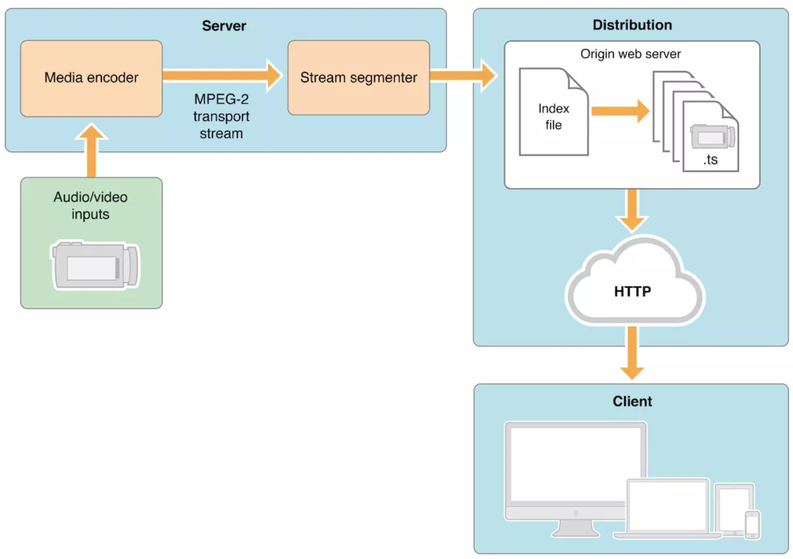

HTTP Live Streaming提供了一种可靠的，具有成本效益的方式，可以通过Internet传递连续的和长格式的视频。
它允许接收器使媒体的比特率适应当前的网络条件，以保持最佳质量的不间断播放。

<!-- more -->
HLS是一套解决方案, 包含三个部分：




## 索引文件(Playlist)

### 基础标签
#### `#EXTM3U`
表明该文件是一个扩展M3U Playlist 文件，每个 媒体 索引文件(Playlist)文件的第一行必须是这个tag。


#### `#EXT-X-VERSION:<n>`
表明 Playlist 其关联的媒体及服务器的兼容版本。
> n是整数，表明协议兼容性的版本号。
它必须出现在 所有包含与协议版本1不兼容的标签或属性的 Playlist 中，以支持与较旧客户端的互操作性
PS: 互操作性（Interoperability ）又称互用性，是指不同的计算机系统、网络、操作系统和应用程序一起工作并共享信息的能力。

1、若 Playlist 有 EXT-X-KEY标签的IV属性，那 n 必须大于等于2
2、若 Playlist 有 浮点  EXTINF  持续时间值，那 n 必须大于等于3
3、若 Playlist 有 EXT-X-BYTERANGE标签、EXT-X-I-FRAMES-ONLY标签，那 n 必须大于等于4
4、若 Playlist 有 EXT-X-KEY 标记的 KEYFORMAT 和 KEYFORMATVERSIONS 属性、EXT-X-MAP标签，那 n 必须大于等于5
5、若 Playlist 有 EXT-X-MAP 标签，不包含EXT-X-I-FRAMES-ONLY，那 n 必须大于等于6
6、若 Playlist 中 EXT-X-MEDIA 标记的 INSTREAM-ID 属性的 “SERVICE”值 ，那 n 必须大于等于7

EXT-X-MEDIA标记 以及 REAM-INF标记的AUDIO，VIDEO和SUBTITLES属性向后兼容协议版本1，但在较旧的客户端上播放可能不是理想的。
协议版本 6 中删除了EXT-X-STREAM-INF和EXT-X-I-FRAME-STREAM-INF标签的PROGRAM-ID属性。
协议版本 7 中删除了EXT-X-ALLOW-CACHE标签。

### 媒体片段标签
#### `#EXTINF:<duration>,[<title>]`
指定媒体片段的持续时间，仅适用于下一个媒体片段，每个媒体片段均需要此标签。
> duration是十进制浮点数或十进制整数数字（以秒为单位）
如果兼容版本号小于3，则持续时间必须为整数


#### `#EXT-X-BYTERANGE:<n>[@<o>]`
指示 子范围(sub-range) 的长度（以字节为单位），n是十进制整数。
> o是一个十进制整数，表示 子范围 的开始，以距资源开始的字节偏移量为单位.
如果o不存在，则 子范围 从上一个媒体段的子范围之后的下一个字节开始。
没有 EXT-X-BYTERANGE 标签 的媒体片段 由其URI标识的整个资源组成


#### `#EXT-X-DISCONTINUITY`（不连续性）
指示在其之后的媒体片段与在其之前的媒体段之间的不连续性。
如果以下任何特征发生变化，就 必须 存在EXT-X-DISCONTINUITY标签：
  1. 文件格式
	2. 轨道(tracks)的编号、类型和标识符
	3. 时间戳序列

如果以下任何特征发生变化，则 应该 存在EXT-X-DISCONTINUITY标签：
  1. 编码参数
	2. 编码顺序

#### `#EXT-X-KEY:<attribute-list>`
媒体片段可以加密， EXT-X-KEY标记指定如何解密它们。

- METHOD
该值是一个指定加密方法的枚举字符串。此属性是必需的。
定义的方法为：NONE，AES-128和SAMPLE-AES。
NONE的加密方法表示媒体段未加密。如果加密方法为NONE，则不得存在其他属性。

AES-128 的一种加密方法表示媒体段已使用具有128位密钥的高级加密标准[AES_128]，密码块链接和PKCS7填充[RFC5652]进行了完全加密。使用IV属性值或Media Sequence Number作为IV，在每个段边界重新启动CBC。

SAMPLE-AES 的加密方法意味着媒体段包含使用高级加密标准[AES_128]加密的媒体样本，例如音频或视频。这些媒体流如何在片段中加密和封装取决于片段的媒体编码和媒体格式。 fMP4 Media Segments使用通用加密[COMMON_ENC]的'cbcs'方案进行加密。 HLS样本加密[SampleEnc]规范中描述了其他包含H.264 [H_264]，AAC [ISO_14496]，AC-3 [AC_3]和增强型AC-3 [AC_3]媒体流的媒体段格式的加密。 IV属性可以存在；

- URI
该值是带引号的字符串，其中包含指定如何获取密钥的URI。除非METHOD为NONE，否则此属性是必需的。

- IV
该值是一个十六进制序列，它指定要与密钥一起使用的128位无符号整数初始化向量。使用IV属性需要兼容版本号为2或更大

- KEYFORMAT
该值是带引号的字符串，它指定在URI标识的资源中表示密钥的方式。


eg：
```
#EXTM3U
#EXT-X-VERSION:3
#EXT-X-MEDIA-SEQUENCE:7794
#EXT-X-TARGETDURATION:15

#EXT-X-KEY:METHOD=AES-128,URI="https://priv.example.com/key.php?r=52"

#EXTINF:2.833,
http://media.example.com/fileSequence52-A.ts
#EXTINF:15.0,
http://media.example.com/fileSequence52-B.ts
#EXTINF:13.333,
http://media.example.com/fileSequence52-C.ts

#EXT-X-KEY:METHOD=AES-128,URI="https://priv.example.com/key.php?r=53"

#EXTINF:15.0,
http://media.example.com/fileSequence53-A.ts
```

#### `#EXT-X-MAP:<attribute-list>`
指定如何获取解析合适的媒体片段所需的媒体初始化段

##### `#EXT-X-PROGRAM-DATE-TIME:<YYYY-MM-DDThh:mm:ss.SSSZ>`
将一个媒体段的第一个 Sample 与 一个绝对日期或时间相关联。 只对下一个 meida URI 有效。

例子: #EXT-X-PROGRAM-DATE-TIME:2010-02-19T14:54:23.031+08:00
eg：
`#EXT-X-PROGRAM-DATE-TIME:2010-02-19T14:54:23.031+08:00`
EXT-X-PROGRAM-DATE-TIME 标签应提供毫秒级的精度。

##### `#EXT-X-DATERANGE:<attribute-list>`
将日期范围（即由开始日期和结束日期定义的时间范围）与一组属性/值对相关联
详情请看：[https://tools.ietf.org/html/draft-pantos-http-live-streaming-23#page-17](https://tools.ietf.org/html/draft-pantos-http-live-streaming-23#page-17)
eg:
```
#EXTM3U
...
#EXT-X-DATERANGE:ID="splice-6FFFFFF0",START-DATE="2014-03-05T11:
15:00Z",PLANNED-DURATION=59.993,SCTE35-OUT=0xFC002F0000000000FF0
00014056FFFFFF000E011622DCAFF000052636200000000000A0008029896F50
000008700000000

... Media Segment declarations for 60s worth of media

#EXT-X-DATERANGE:ID="splice-6FFFFFF0",DURATION=59.993,SCTE35-IN=
0xFC002A0000000000FF00000F056FFFFFF000401162802E6100000000000A00
08029896F50000008700000000
...
```

### 媒体播放列表标签
#### `#EXT-X-TARGETDURATION:<s>`
指定最大媒体段持续时间。
索引文件中每个媒体片段的EXTINF持续时间四舍五入到最接近的整数时，必须小于或等于目标持续时间； 较长的片段会触发播放停顿或其他错误


#### `#EXT-X-MEDIA-SEQUENCE:<number>`
指示出现在索引文件中的第一个媒体片段的媒体序列号。
> 如果媒体播放列表文件不包含 EXT-X-MEDIA-SEQUENCE 标记，则索引列表中第一个媒体片段的媒体序列号应被视为0。


##### `#EXT-X-DISCONTINUITY-SEQUENCE:<number>`
表明允许在 相同变体流或媒体索引文件中 具有 EXT-X-DISCONTINUITY 标签的 不同变体流的不同表现形式之间进行同步。
详情看：[https://tools.ietf.org/html/draft-pantos-http-live-streaming-23#page-22](https://tools.ietf.org/html/draft-pantos-http-live-streaming-23#page-22)

#### `#EXT-X-ENDLIST`
表明没有更多的媒体片段将被添加到媒体播放列表文件。
它可能出现在媒体播放列表文件中的任何位置。

#### `#EXT-X-PLAYLIST-TYPE:<EVENT|VOD>`
提供有关媒体索引文件的可变性信息。 适用于整个媒体索引文件。
- 为EVENT时，则只能将媒体段添加到媒体播放列表的末尾。
- 为VOD时，则媒体索引列表无法更改。

##### `#EXT-X-I-FRAMES-ONLY`
仅指示索引列表中的每个媒体片段都描述单个I-frame。 I-frame（Intra frames）是编码的视频帧，其编码不依赖于任何其他帧。
I-frame播放列表可用于特技播放，例如快进，快退和擦洗(scrubbing)。

### 主播放列表(Master Playlist)标签
#### `#EXT-X-MEDIA:<attribute-list>`
标记用于关联包含相同内容的替代音译的媒体索引列表。
例如，三个EXT-X-MEDIA标签可用于识别仅包含音频的媒体索引列表，该列表包含同一演示文稿的英语，法语和西班牙语。
或两个EXT-X-MEDIA标签可用于识别显示两个不同摄像机角度的纯视频媒体播放列表。

详情看：[https://tools.ietf.org/html/draft-pantos-http-live-streaming-23#page-24](https://tools.ietf.org/html/draft-pantos-http-live-streaming-23#page-24)
##### `#EXT-X-STREAM-INF:<attribute-list>`
指定一个Variant Stream，这是一组可组合以播放演示文稿的渲染。
EXT-X-STREAM-INF标记后的URI行指定了一个媒体索引列表，该列表带有Variant Stream的呈现。 URI行是必需的。 不支持多个视频转场的客户端应播放此转场。

##### `#EXT-X-MEDIA:<attribute-list>`
标识包含多媒体演示文稿的 I-frames 的媒体索引列表文件。它独立存在，因为它不适用于主播放列表中的特定URI。


####  `#EXT-X-SESSION-DATA:<attribute-list>`
标记允许在主播放列表中携带任意session数据。

#### `#EXT-X-SESSION-KEY:<attribute-list>`
标记允许在主播放列表中指定媒体索引列表中的加密密钥。 这样，客户端就可以预先加载这些密钥，而不必先阅读媒体索引列表。

### 媒体或主播放列表标签

##### `#EXT-X-INDEPENDENT-SEGMENTS`
标记指示可以解码媒体片段中的所有媒体样本，而无需其他段的信息。它适用于索引列表中的每个媒体片段。

##### `#EXT-X-START:<attribute-list>`
标记指示开始播放索引列表的首选点。默认情况下，客户端应该在开始回放会话时在此时开始回放。 此标签是可选的。


资料: [https://tools.ietf.org/html/draft-pantos-http-live-streaming-23](https://tools.ietf.org/html/draft-pantos-http-live-streaming-23)
