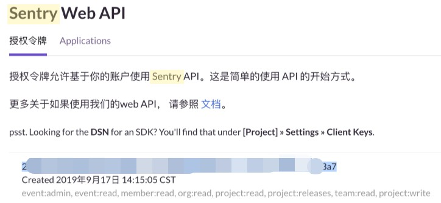
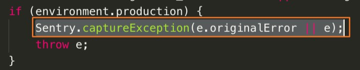
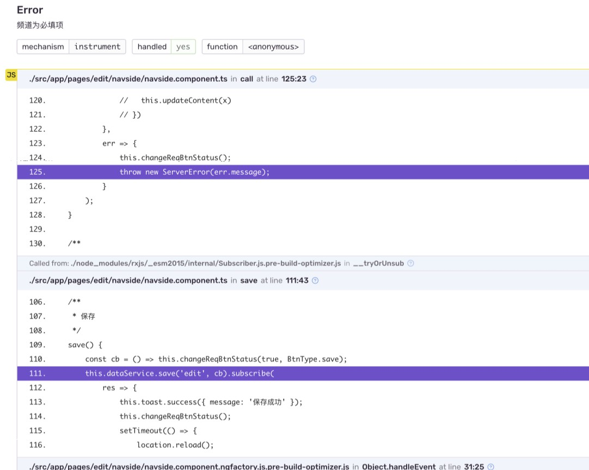

Sentry简介：“跨平台应用监控，关注错误报告”。
<!-- more -->

### 什么是sentry
Sentry是一个开源的错误跟踪工具，用于捕获异常，可根据错误类型对异常进行分类整理，便于监控和解决代码问题。

官网： https://sentry.io
文档： https://docs.sentry.io/clients/javascript/install/
git仓库： https://github.com/getsentry/sentry

### sentry 接入
我们内部提供了基于sentry.io的实现的sentry.oa。这里针对内部使用场景记录实践。如需了解官方接入方式参考[sentry.io](https://github.com/getsentry/sentry-cli)

1. 安装sentry-cli

`npm install @sentry/cli`
也需要安装 @sentry/browser

2. 登录
```
# 获取token
export SENTRY_URL=https://sentry.oa.com
sentry-cli login
```
填token


3. 进入.sentryclirc文件加配置
`vim .sentryclirc`
```
[auth]
token=<项目token>

[defaults]
url=https://sentry.oa.com
org=<公司组织>
```


4. 项目中入口文件引入sentry

```
import * as Sentry from "@sentry/browser";

Sentry.init({
    dsn: <sentry.oa给出的DSN地址>,
    release: <版本号>
});
```

5. error handler加sentry捕获


6. 项目打包生成map文件
修改`angular.json`配置`"sourceMap": true`


7. 上传.map文件到sentry.oa
前端项目基本都会压缩混淆代码，这样导致Sentry捕捉到的异常堆栈无法理解。
如果希望在Sentry直接看到异常代码的源码时就需要上传对应的source和map。
所以这一步是为了错误上报之后，sentry能帮我们定位到问题代码。
```
# 配置项目，上传文件
export SENTRY_PROJECT=<项目名称>
export SENTRY_ORG=<公司组织>
sentry-cli releases new <版本号>
sentry-cli releases finalize <版本号>

sentry-cli releases files <版本号> upload-sourcemaps <打包后的文件目录 eg: dist/xxx> --rewrite --url-prefix <线上资源URI eg: '~/xxx'> <打包出来的js文件所在目录 eg: './dist/xxx'>

eg:
sentry-cli releases files demo-test upload-sourcemaps --url-prefix '~/static/js' './dist/static/js'
```
效果图：


> 注意: starff-wifi sentry-cli 提交不了 map 文件